# 开发文档

## 一，后端创建接口流程（以FrameProperty为例）

## 二，登陆页面

### 登录部分

## 三，首页

## 四，数据集管理

### 1.数据集列表

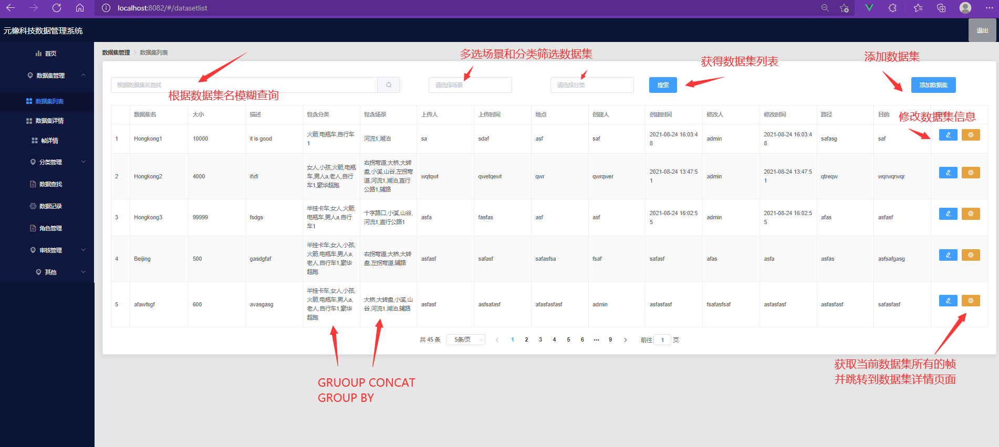

### 2.数据集详情（帧）

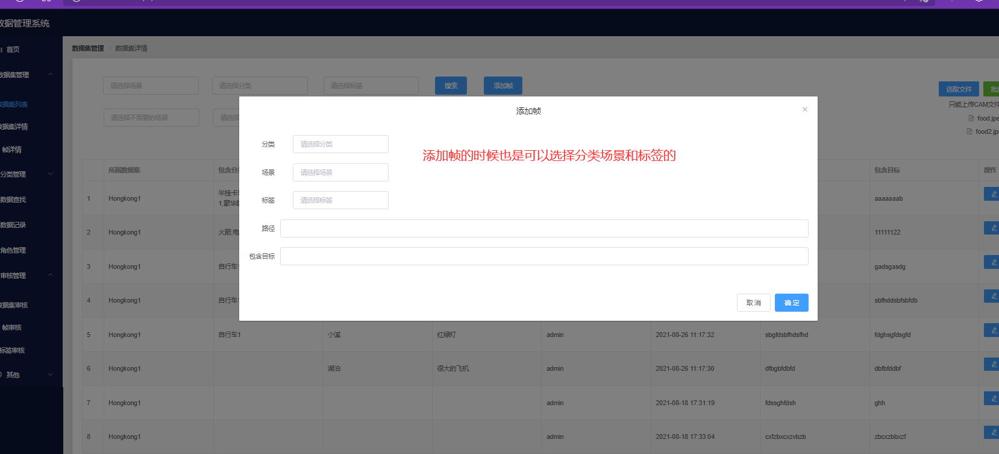

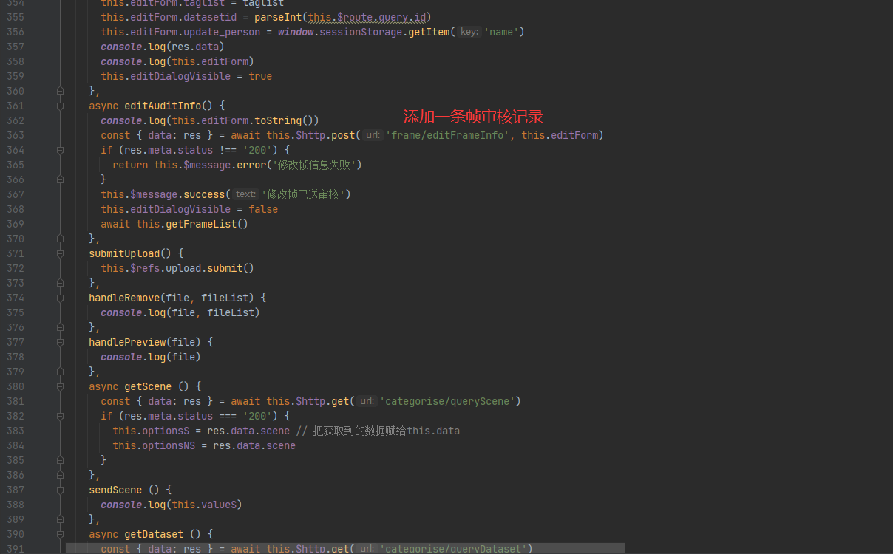

### 3.帧详情（标签）

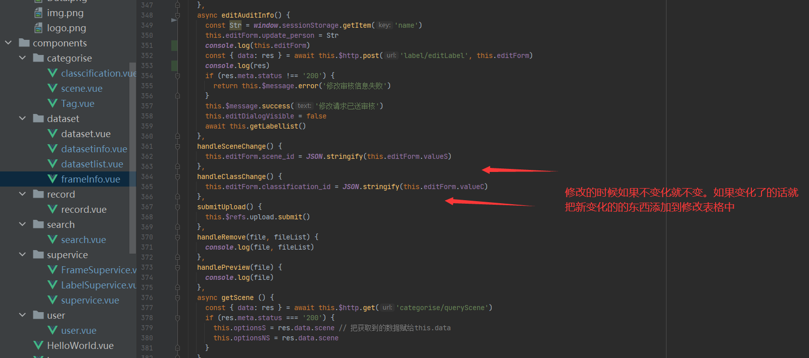*

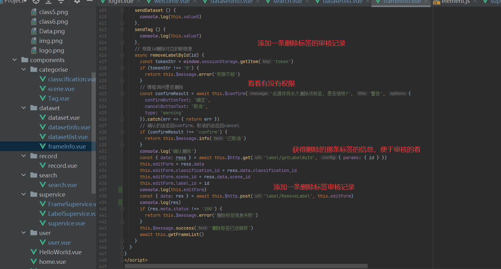

## 五，分类管理

### 1.场景

这三个都十分类似，依葫芦画瓢就行了

### 

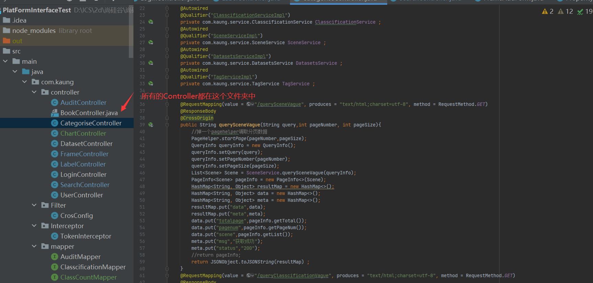

### 2.分类

和场景类似，依葫芦画瓢就行

### 3.标签

和场景类似，依葫芦画瓢就行

## 六，数据查找

## 七，角色管理

其他都差不多

## 八，审核管理

### 1.数据集审核

### 

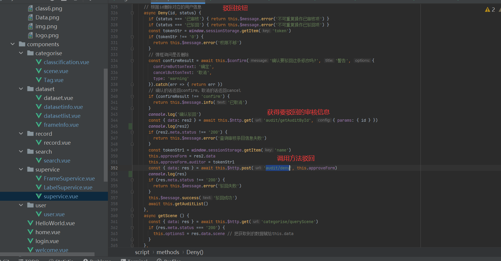

### 2.帧审核

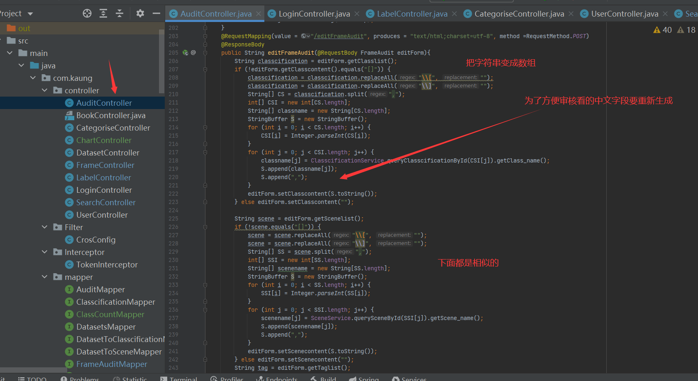

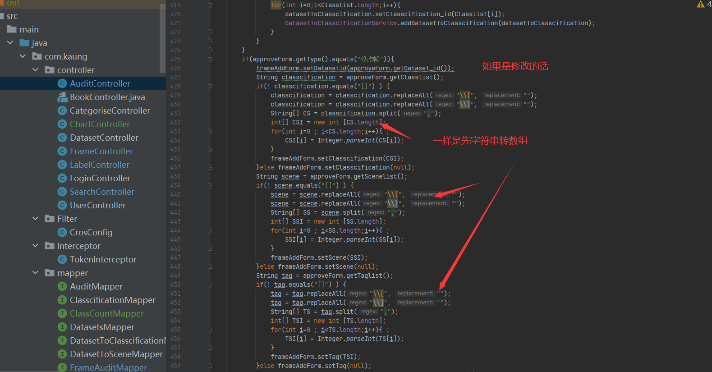

### 3.标签审核

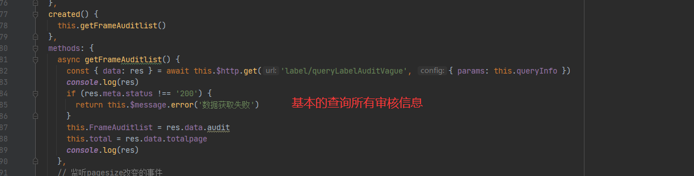

## 九，数据库以及Vue设置

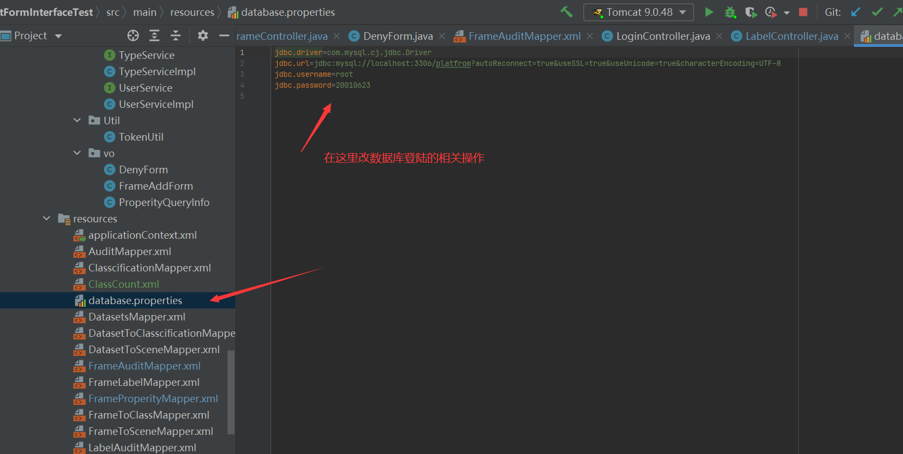

## 十，部署方式

将jar包或war包放入tomcat的webapp文件夹，在Vue终端中输入npm run build打一个dist包，放入tomcat的webapp文件夹并改名为ROOT

用户名 zpy

密码 20010623

## 十一，依赖

基于Vue3.0以上的Vue  ui开发，可以直接用VUE UI编译项目文件

